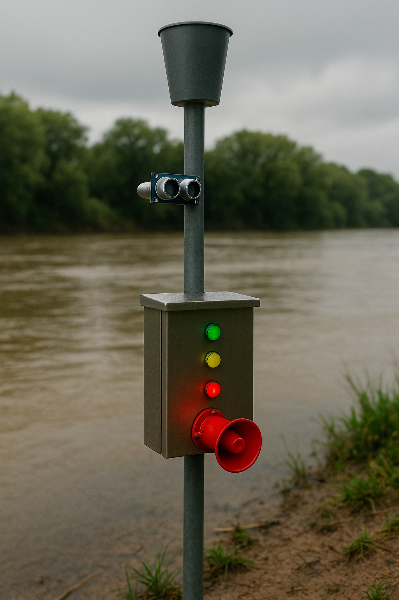

# Sistema de Monitoramento de Transbordamento de Rios 📢

## Descrição do Problema ⚠️

O transbordamento e a elevação repentina do nível da água em rios podem causar desabrigamento de famílias, prejuízos econômicos e riscos à saúde pública. Eventos extremos, como o transbordamento do [Rio Tietê em Salto (SP), fevereiro de 2022](https://cultura.uol.com.br/noticias/46161_apos-fortes-chuvas-rio-tiete-transborda-em-cidades-do-interior-de-sao-paulo.html), mostraram que vazões que passaram de 130 m³/s para 700 m³/s elevaram o leito em até 9 m, deixando dezenas de famílias desabrigadas e gerando alagamentos significativos.

## Importância da Solução

- **Prevenção de vítimas e feridos**: ao antecipar o risco de transbordamento, é possível avisar moradores e equipes de resgate com antecedência. ✅
- **Minimização de danos materiais**: alertas precoces garantem tempo para remoção de bens e ativação de planos de contingência. ✅
- **Orientação à população**: mudanças de rota e evacuações podem ser realizadas de forma mais segura e organizada. ✅
 
## Visão Geral da Solução

Nosso sistema simples e eficiente monitora dois parâmetros críticos:

1. **Precipitação** 🌧️

   - Simulada por um **potenciômetro** (0–1023) que equivale a 0–50 mm de chuva.
   - Chuva fraca: ≤ 24 mm
   - Chuva forte: > 24 mm

2. **Nível da Água** 🌊
   - Medido por um **sensor ultrassônico (HC-SR04)** que calcula a distância até a superfície da água.
   - **Nível seguro**: > 100 cm
   - **Nível de atenção**: 50 cm – 100 cm
   - **Nível de perigo**: < 50 cm

### Indicação e Alertas 🚨

- **LED Verde** — nível seguro
- **LED Amarelo** — atenção
- **LED Vermelho** — perigo
- **Buzzer** — dispara em nível de perigo (sirene simulada)
- **Alerta de chuva intensa** — qualquer leitura de chuva > 24 mm aciona um alerta e caso o nivel estiver em atenção, aciona o buzzer
 
### Imagem Ilustrativa do projeto 📷
> Gerado com I.A.

# Guia Rápido de Simulação no Wokwi 📒

1. **Abra o projeto**  
   <a href="https://wokwi.com/projects/432216818038467585" target="_blank" >Clique aqui!</a>

3. **Inicie a simulação**  
   Pressione **“Start Simulation”** no canto superior esquerdo.

4. **Testando o nível da água**

   - Clique no sensor ultrassônico (HC-SR04).
   - Ajuste o controle de **“Distance”** para simular a água subindo e descendo.

5. **Testando a intensidade da chuva**

   - Clique no potenciômetro.
   - Gire o botão (ou ajuste o valor) para simular chuva fraca ou forte.

6. **Veja o resultado**
   - LEDs mudam de cor conforme o nível do rio.
   - Buzzer dispara em caso de nível crítico ou chuva intensa + nivel de atenção.

> Pronto! Só isso: ajuste os controles de distância e de potenciômetro para avaliar o comportamento do sistema. 😁
